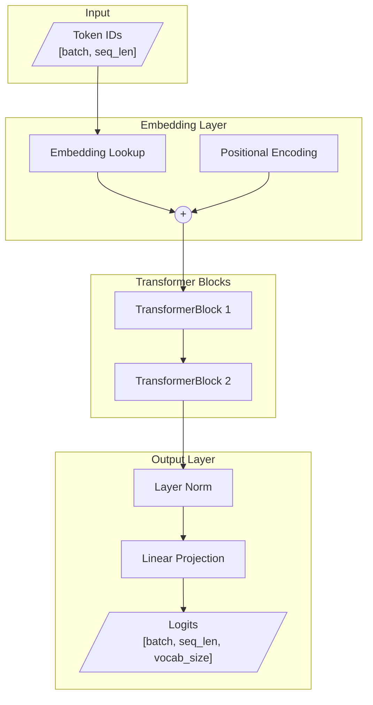
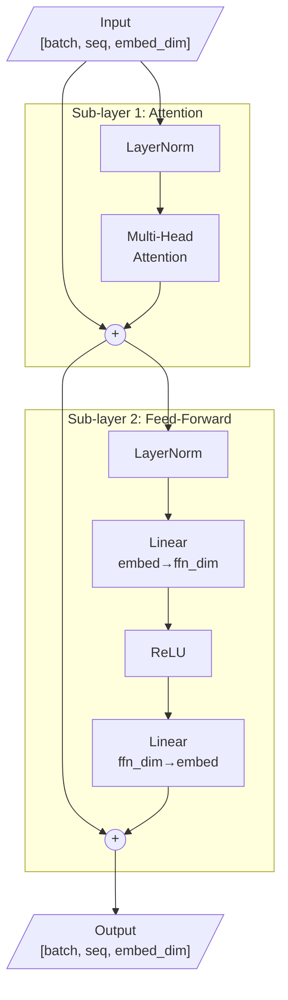
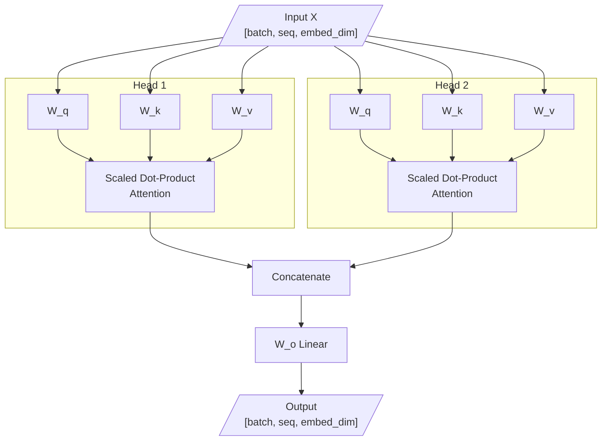
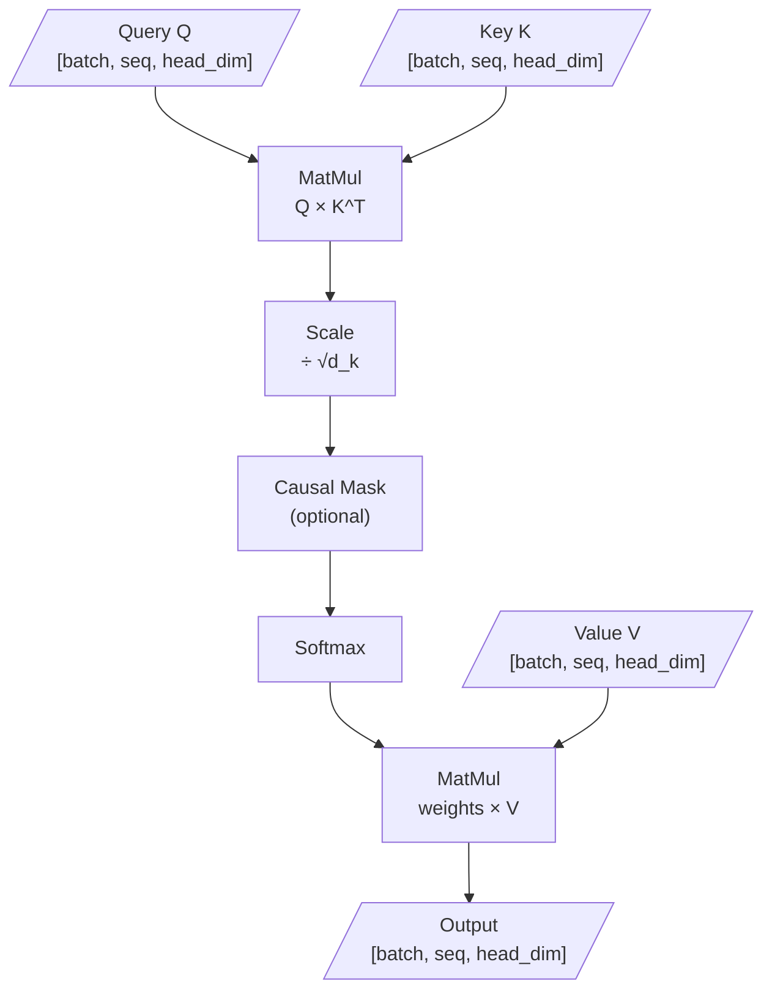
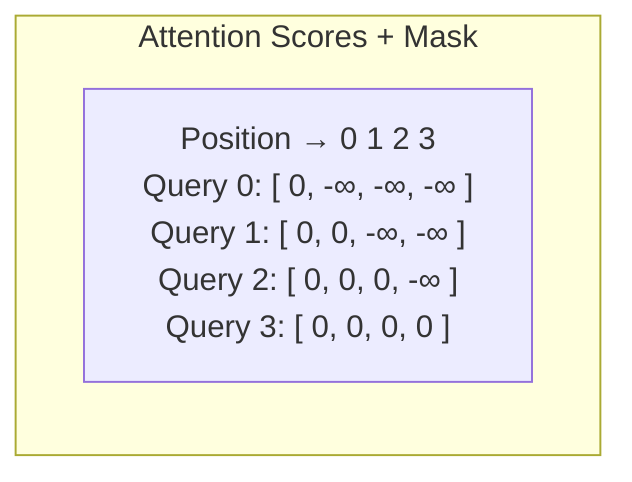
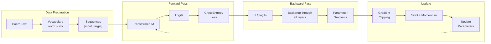
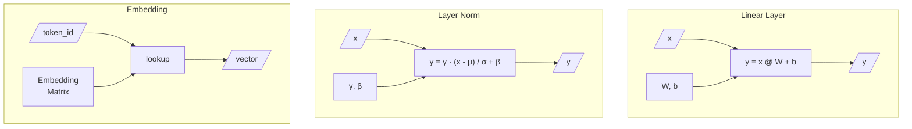
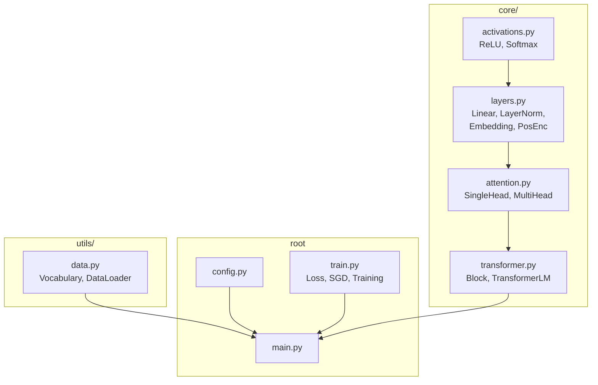

# Transformer Architecture

Visual diagrams of the transformer implementation.

## High-Level Architecture

## Transformer Block (Pre-LayerNorm)

## Multi-Head Attention

## Scaled Dot-Product Attention

## Causal Mask

Prevents attending to future positions during autoregressive generation:

## Training Data Flow

## Layer Components

## File Structure

## Parameter Count

| Component | Parameters |
|-----------|------------|
| Embedding | vocab_size × embed_dim = 13 × 32 = 416 |
| Per Attention Head | 3 × (embed_dim × head_dim + head_dim) = 3 × (32 × 16 + 16) = 1,584 |
| Multi-Head (2 heads) | 2 × 1,584 + (embed_dim × embed_dim + embed_dim) = 4,224 |
| FFN per Block | 2 × (embed_dim × ffn_dim + ffn_dim) = 2 × (32 × 64 + 64) = 4,224 |
| LayerNorm per Block | 2 × 2 × embed_dim = 128 |
| Per Block Total | 4,224 + 4,224 + 128 = 8,576 |
| 2 Blocks | 17,152 |
| Final LayerNorm | 64 |
| Output Projection | embed_dim × vocab_size + vocab_size = 32 × 13 + 13 = 429 |
| **Total** | **~18,000** |
